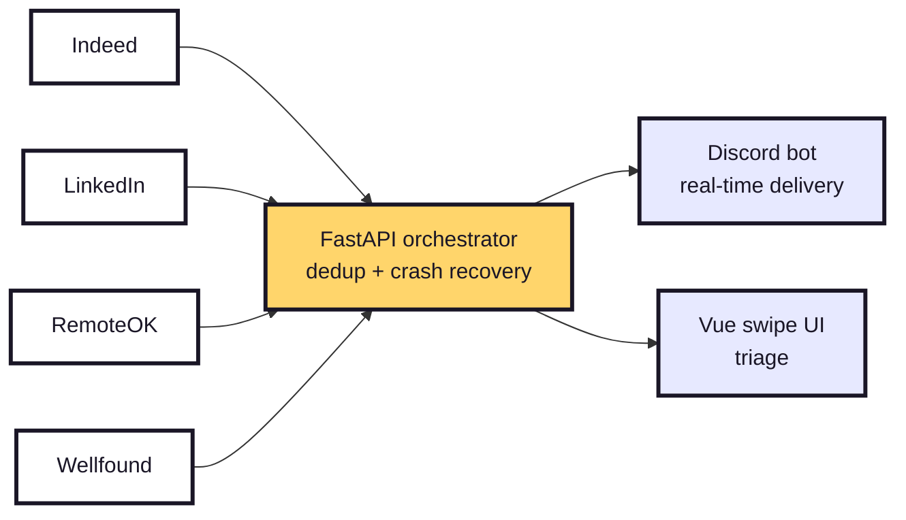

<!-- ════════ SLIDE 1 — COVER ════════ -->
<div class="js-cover">

<div class="js-kicker">Automated Job Discovery</div>

# Job<span class="serif">Scraper</span>

<div class="js-tagline">Job hunting, automated <span class="serif">end-to-end</span>.</div>

<div class="js-lede">

Scrapes four job boards, delivers curated matches to Discord in real time,
and lets you triage them like a dating app.

</div>

<div class="js-cover-mascot">
  <svg width="300" height="300" viewBox="0 0 200 200" class="mfloat">
    <line x1="100" y1="42" x2="100" y2="22" stroke="#1A1626" stroke-width="3" stroke-linecap="round"/>
    <circle cx="100" cy="18" r="6.5" fill="#FFD56B" stroke="#1A1626" stroke-width="2.5"/>
    <path d="M40,110 C40,70 65,45 100,45 C135,45 160,70 160,110 C160,140 145,165 100,165 C55,165 40,140 40,110 Z" fill="#FFD56B" stroke="#1A1626" stroke-width="3.5"/>
    <line x1="50" y1="115" x2="32" y2="138" stroke="#1A1626" stroke-width="3.5" stroke-linecap="round"/>
    <circle cx="30" cy="140" r="6.5" fill="#1A1626"/>
    <line x1="150" y1="115" x2="168" y2="138" stroke="#1A1626" stroke-width="3.5" stroke-linecap="round"/>
    <circle cx="170" cy="140" r="6.5" fill="#1A1626"/>
    <path d="M76,94 C76,89 80,86 84,89 C88,86 92,89 92,94 C92,99 84,106 84,106 C84,106 76,99 76,94 Z" fill="#E84B36" stroke="#1A1626" stroke-width="2"/>
    <path d="M108,94 C108,89 112,86 116,89 C120,86 124,89 124,94 C124,99 116,106 116,106 C116,106 108,99 108,94 Z" fill="#E84B36" stroke="#1A1626" stroke-width="2"/>
    <path d="M84,125 Q100,142 116,125" stroke="#1A1626" stroke-width="3.5" stroke-linecap="round" fill="none"/>
    <circle cx="68" cy="118" r="6" fill="#FF6E5A" opacity="0.55"/>
    <circle cx="132" cy="118" r="6" fill="#FF6E5A" opacity="0.55"/>
  </svg>
</div>

<div class="js-credit">Anaïs · sup4nova.com · github.com/sup4nova/JobScraper</div>

</div>

---
layout: center
class: js-slide js-dots
---

<div class="js-kicker">Where it started</div>

<div class="js-lead">

Job hunting is a soul-crushing spreadsheet: a dozen open tabs, the same listings
on every board, endless manual filtering.

</div>

<div class="js-bigq">What if discovery ran itself — and triage felt like <span class="hl">a game, not a chore?</span></div>

<div class="js-closer">

JobScraper scrapes the boards for me, pushes only **fresh, curated matches** to
Discord, and turns filtering into a <span class="js-swipe">swipe</span>.

</div>

<!-- Slide 2 — THE IDEA. Short, shows product thinking (you solved your own problem). -->

---
layout: two-cols-header
class: js-slide
---

<div class="js-kicker">See it work</div>

# See it <span class="serif">work</span>

::left::

<div class="js-points">

<div class="js-point"><span class="dot c">👉</span> <strong>Swipe to triage</strong> — right to keep, left to pass, up to apply instantly.</div>

<div class="js-point"><span class="dot b">💬</span> New matches land in <strong>Discord in real time</strong>, as cards with apply buttons.</div>

</div>

<a class="js-video" href="#">▶ Watch the 30-second demo</a>

<div class="js-note">Self-hosted: the full pipeline — scrapers + API + Discord bot — runs end-to-end.</div>

::right::

<div class="js-demo-frame">
  
  <div class="js-demo-fallback">📱 Drop a screenshot of the swipe UI at <code>public/demo.png</code></div>
</div>

<!-- Slide 3 — DEMO. The slide that sells. Replace public/demo.png with a real screenshot/GIF. -->

---
class: js-slide js-dots
---

<div class="js-kicker">How it works</div>

# How it <span class="serif">works</span>

<div class="js-arch">



</div>

<div class="js-arch-caption">Four scrapers feed <strong>one resilient pipeline</strong>, delivered two ways.</div>

<!-- Slide 4 — ARCHITECTURE. The mermaid diagram renders natively in Slidev. -->

---
class: js-slide
---

<div class="js-kicker">Four sources</div>

# Four sources, four <span class="serif">defenses</span>

<div class="js-sources">

<div class="js-src"><div class="js-src-name indeed">Indeed</div><div class="js-src-tech">Selenium + <code>undetected-chromedriver</code> — beats bot detection</div></div>

<div class="js-src"><div class="js-src-name linkedin">LinkedIn</div><div class="js-src-tech">Guest HTTP endpoint — no login required</div></div>

<div class="js-src"><div class="js-src-name remoteok">RemoteOK</div><div class="js-src-tech">Public JSON API — clean and direct</div></div>

<div class="js-src"><div class="js-src-name wellfound">Wellfound</div><div class="js-src-tech">Selenium + <code>__NEXT_DATA__</code> extraction</div></div>

</div>

<div class="js-footnote">Plus <span class="chip">deduplication</span> and <span class="chip">crash recovery</span> — one failing source never kills the run.</div>

<!-- Slide 5 — TECHNICAL HIGHLIGHT. The adaptability story: you understood each target. -->

---
layout: two-cols-header
class: js-slide js-dots
---

<div class="js-kicker">The dispatch</div>

# One pipeline, four <span class="serif">strategies</span>

::left::

<div class="js-code-copy">

A single registry maps each source to its own scraper. The orchestrator runs them
independently — a crash in one is caught, logged, and skipped.

</div>

::right::

```python {all}
# one strategy per source — add a board = add a line
SCRAPERS = {
    "indeed":    IndeedScraper,
    "linkedin":  LinkedInScraper,
    "remoteok":  RemoteOKScraper,
    "wellfound": WellfoundScraper,
}

async def run(sources, query, city):
    jobs, seen = [], load_seen()
    for name in sources:
        try:
            scraper = SCRAPERS[name](query, city)
            for job in await scraper.scrape():
                key = job["url"]
                if key not in seen:          # dedup
                    seen.add(key)
                    jobs.append(job)
        except Exception as e:               # crash recovery
            log.warning(f"{name} failed: {e}")
    return jobs
```

<!-- Slide 6 — ONE code slide. The rest of the code lives in the repo. -->

---
layout: center
class: js-slide
---

<div class="js-kicker">The stack</div>

# The <span class="serif">stack</span>

<div class="js-stack-label">Backend &amp; pipeline</div>

<div class="js-stack">
  <div class="tech"><span class="tl" style="background:#3776AB">🐍</span> Python 3</div>
  <div class="tech"><span class="tl" style="background:#009688">API</span> FastAPI</div>
  <div class="tech"><span class="tl" style="background:#43B02A">Se</span> Selenium</div>
  <div class="tech"><span class="tl" style="background:#5865F2">💬</span> Discord</div>
</div>

<div class="js-stack-label">Frontend &amp; ops</div>

<div class="js-stack">
  <div class="tech"><span class="tl" style="background:#42b883">V</span> Vue 3</div>
  <div class="tech"><span class="tl" style="background:#3178C6">TS</span> TypeScript</div>
  <div class="tech"><span class="tl" style="background:#2496ED">🐳</span> Docker</div>
</div>

<!-- Slide 7 — STACK. Visual, scannable. -->

---
class: js-slide js-dots
---

<div class="js-kicker">Challenges &amp; learnings</div>

# Challenges &amp; <span class="serif">learnings</span>

<div class="js-chal-grid">

<div class="js-chal c1">
<div class="emoji">🕵️</div>
<h3>The silent killer</h3>
<p class="prob">A regex in my dedup key only matched hex — it silently dropped <em>every</em> job. No error, just empty results.</p>
<p class="act">→ Traced it by logging between each pipeline stage.</p>
<p class="learn">The worst bugs don't crash — they lie. I now log at every stage boundary.</p>
</div>

<div class="js-chal c2">
<div class="emoji">📏</div>
<h3>Discord's hidden limits</h3>
<p class="prob">Posting jobs returned <code>400</code>s whenever a URL went over 512 characters, plus embed caps.</p>
<p class="act">→ Validated and trimmed every payload against Discord's real constraints.</p>
<p class="learn">Design around external API limits instead of assuming them away.</p>
</div>

<div class="js-chal c3">
<div class="emoji">🤖</div>
<h3>Driver conflicts</h3>
<p class="prob">Passing a <code>Service</code> object broke <code>undetected-chromedriver</code> — the layers clashed.</p>
<p class="act">→ Let undetected-chromedriver manage its own driver lifecycle.</p>
<p class="learn">Read how a library expects to be used, not force my own model.</p>
</div>

</div>

<!-- Slide 8 — CHALLENGES. 3 real bugs, each as problem -> action -> learning. -->

---
class: js-slide
---

<div class="js-kicker">What's next</div>

# What's <span class="serif">next</span>

<div class="js-next">

<div class="js-next-item n1"><div class="nemoji">🚀</div><div><div class="nt">Deploy on Railway with a demo mode</div><div class="nd">Ship a fixture-data mode so anyone can try the swipe UI without running live scrapers.</div></div></div>

<div class="js-next-item n2"><div class="nemoji">🧹</div><div><div class="nt">Finish the edge cases</div><div class="nd">Wellfound's empty <code>company</code> field, RemoteOK's UTF-8 encoding quirks.</div></div></div>

<div class="js-next-item n3"><div class="nemoji">📄</div><div><div class="nt">AI-assisted CV generation</div><div class="nd">Auto-tailor a resume to each job I keep, straight from the swipe.</div></div></div>

</div>

<!-- Slide 9 — LIMITS & NEXT. Turning your real TODO list into a roadmap = maturity. -->

---
layout: center
class: js-slide js-thanks
---

<div class="js-thanks-mascot">
  <svg width="150" height="150" viewBox="0 0 200 200" class="mfloat">
    <line x1="100" y1="42" x2="100" y2="22" stroke="#1A1626" stroke-width="3" stroke-linecap="round"/>
    <circle cx="100" cy="18" r="6.5" fill="#FF6E5A" stroke="#1A1626" stroke-width="2.5"/>
    <path d="M40,110 C40,70 65,45 100,45 C135,45 160,70 160,110 C160,140 145,165 100,165 C55,165 40,140 40,110 Z" fill="#FFD56B" stroke="#1A1626" stroke-width="3.5"/>
    <path d="M76,94 C76,89 80,86 84,89 C88,86 92,89 92,94 C92,99 84,106 84,106 C84,106 76,99 76,94 Z" fill="#E84B36" stroke="#1A1626" stroke-width="2"/>
    <path d="M108,94 C108,89 112,86 116,89 C120,86 124,89 124,94 C124,99 116,106 116,106 C116,106 108,99 108,94 Z" fill="#E84B36" stroke="#1A1626" stroke-width="2"/>
    <path d="M82,124 Q100,146 118,124" stroke="#1A1626" stroke-width="3.5" stroke-linecap="round" fill="none"/>
  </svg>
</div>

# Thanks <span class="serif">👀</span>

<div class="js-links">
  <a class="lk demo" href="#"><span class="lkl">Live demo</span><span class="lkv">app.sup4nova.com</span></a>
  <a class="lk code" href="#"><span class="lkl">Code</span><span class="lkv">github.com/sup4nova/JobScraper</span></a>
  <a class="lk port" href="#"><span class="lkl">Portfolio</span><span class="lkv">sup4nova.com</span></a>
  <a class="lk mail" href="#"><span class="lkl">Contact</span><span class="lkv">contact@sup4nova.com</span></a>
</div>

<!-- Slide 10 — CLOSE. Clear CTA: demo, repo, contact. -->
